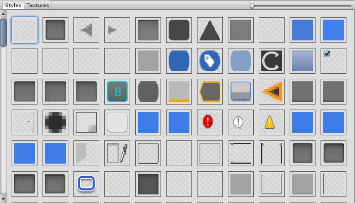
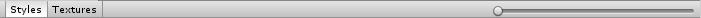

# Style Browser

Style Browser is an easy to use Editor Window that allows you to view all of the built in styles and textures that Unity has built into it. Simply right click and the item will be copied to your clipboard.

## Features

* Pick to view all styles or textures

* Right click copies the style or texture

### Submoudles
* [GUIGird](): Used to draw the grid that displays the elements.
* [Capture Groups](): Used to draw screen shots for the wiki.

### Credit 

Style Browser was originally designed to replace the open source [BuiltInResourcesWindow](http://wiki.unity3d.com/index.php/Show_Built_In_Resources) on the Unity Wiki. This script I found super helpful but it was not really well written. So I expanded upon it. 

### TODO:
* Add loader for textures

### Meta

Handcrafted by Byron Mayne [[twitter](https://twitter.com/byMayne) &bull; [github](https://github.com/ByronMayne)]

Released under the [MIT License](http://www.opensource.org/licenses/mit-license.php).
